# Format String Vulnerability Exploit

Performing an exploit of Format String Vulnerability to leak information. Given a C compiled vulnerable software, with the help of reverse engineering and debugging; the attack had to be conducted to obtain dumb and smart leak of information.

## Prepare Ubuntu VM
Follow these steps to setup the VM and import the binary:
1. Install the prerequisites
        
        sudo apt-get install libncurses5-dev libncursesw5-dev libx11-dev libsdl1.2-dev libsdl-ttf2.0-dev libsdl-mixer1.2-dev libsdl-image1.2-dev
2. Make the angband folder

        sudo mkdir /angband
3. Change the owner of the newly created folder to that of the USER

        sudo chown $USER:$USER /angband
4. Copy the contents of the tar file into the newly created /angband folder 

        tar -xvf /angband.tar && cp -r angband/* /angband
4. Try running the binary file (if the file is not executable change the mode).

        ./angbandv4_stripped
    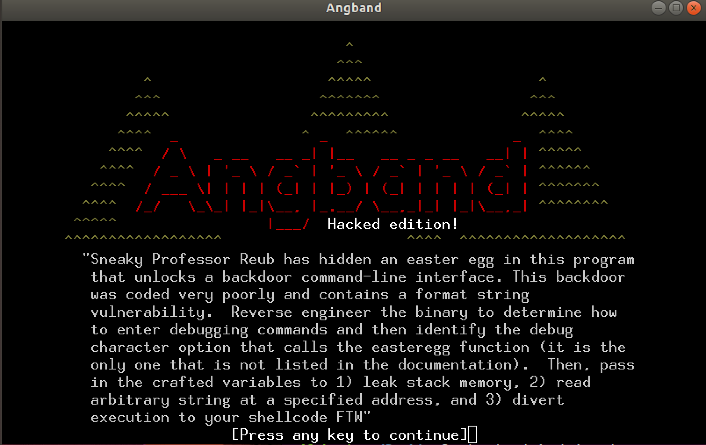

    Running with -msdl and -ssdl options and enable sound and graphics in the game settings 

        ./angbandv4_stripped -msdl -ssdl
    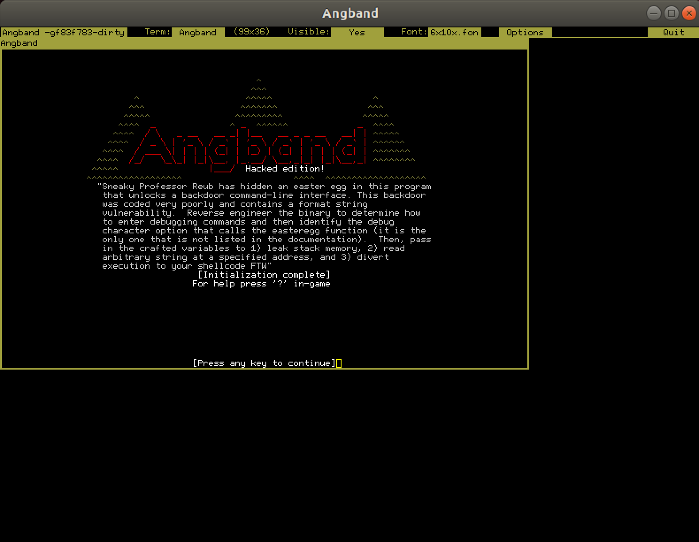
    

## Reverse Engineer Using Ghidra
Follow these steps to reverse engineer the binary using Ghidra:
1. Import the 64-bit Linux Binary into Ghidra

    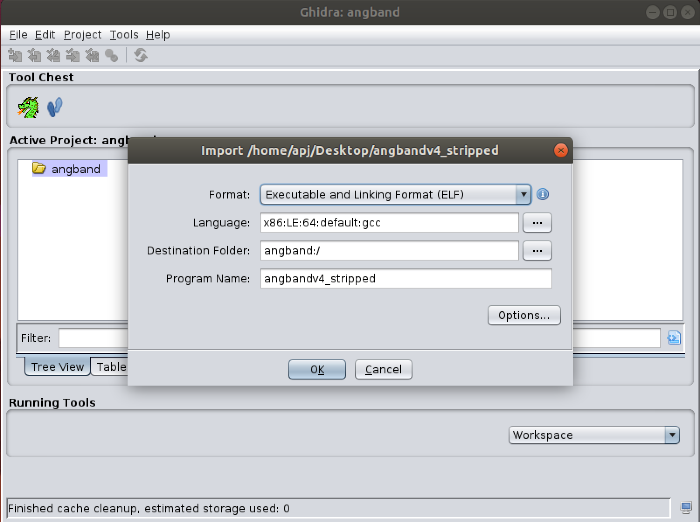
2. After Ghidra analyses the binary, by going through the SymbolTree a vulnerable memory function is found that this software uses. This function is found to be "printf", a format string vulnerable C function that is being used by this application.

    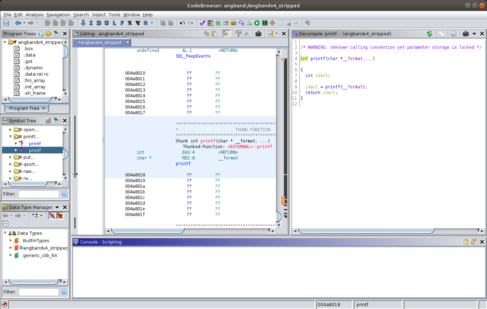
3. Using this knowledge the vulnerable function call that calls this function can be observed and also a Functon Call Graph can be plotted correspondingly.

    The vulnerable function is found as:

    

    The Functon Call Graph is obtained as:

    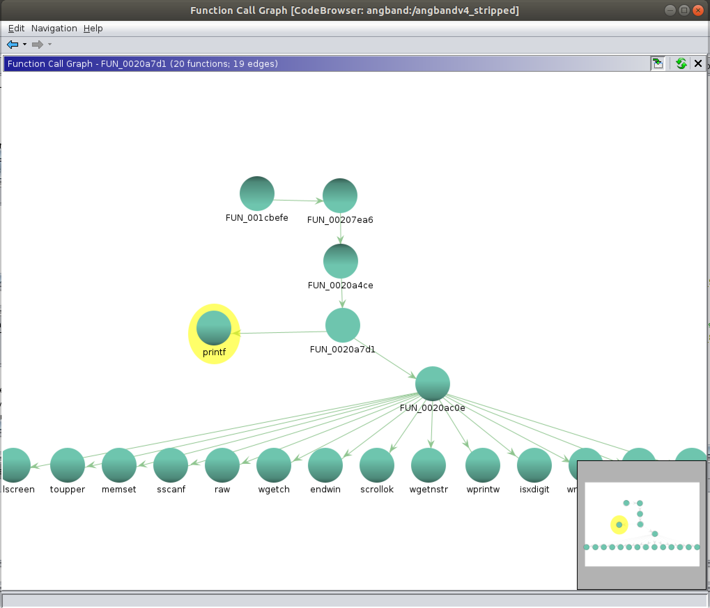

4. By going through the Function Call Graph it can identified that the entry function is "FUN_001cbefe". 

    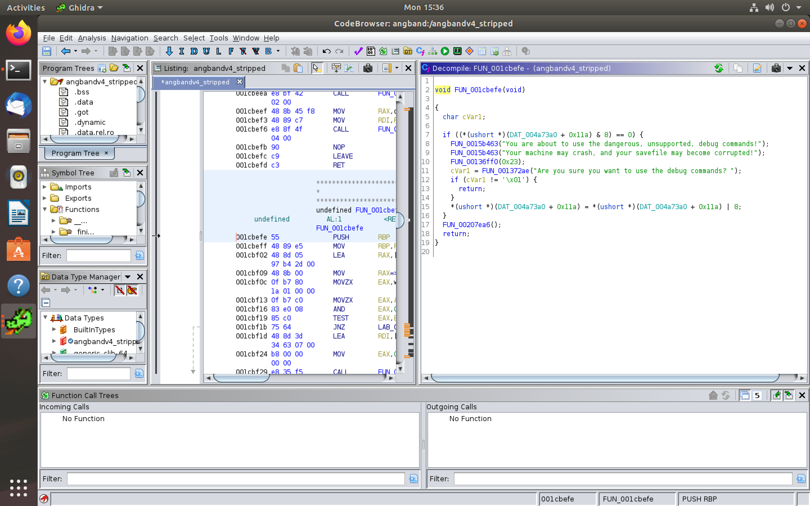

    It is seen that the entry function is the debug function in the game. From the Function call Graph and also the Function definition it is observed that the next function it goes from the entry function is "FUN_00207EA6".

    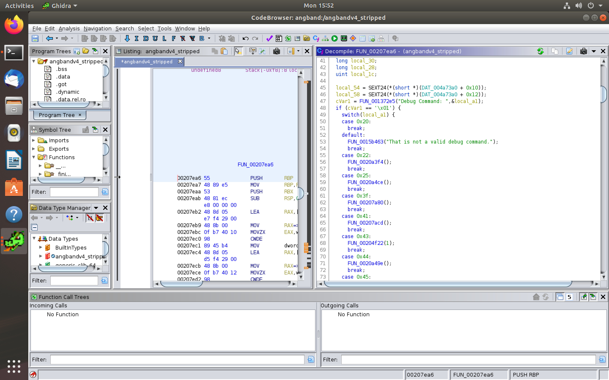

    With reference to the Function Call Graph it is observed that the next function that needs to be called is "FUN_0020A4CE". The corresponding debug command that needs to bbe provided for the function call to occur is the hexadecimal value "\x25" or the ASCII character "%". Tracing the functions in the Function Call Graph it is observed that the debug command "%" is the only required secret code to reach the ultimate vulnerable function that uses _printf()_.

## Debugging using Eclipse

Initially we have to setup the debugging environment:
1. Set GDB command file _~/.gdbinit_ with the following content:

        set disassembly-flavor intel
        set disable-randomization on
2. Set Address Space Randomization off with the following command: 

        sudo sysctl kernel.randomize_va_space=0
3. Eclipse is used for debugging, initially a C/C++ project (C Managed and Linux GCC toolchain) is created and the binary file along with the associated text files are copied. 

4. Now the remote debug configurations for the project is set. This is done by providing the application path in the debug configurations.

    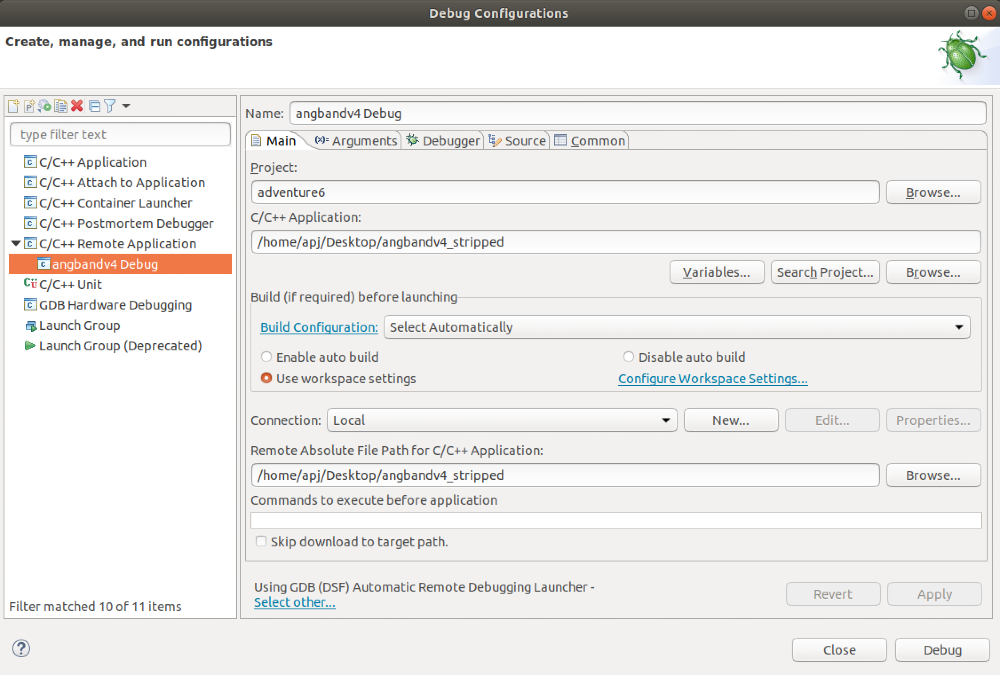

    The location of the GDB command file is also specified as _~/.gdbinit_:

    

5. Upon debugging the dissasembly can be viewed. The debugger can be paused to analyze the disassembly. The vulnerable function is accesssed by providing the secret code "%" as the debug command; this was found during reverse engineering. The input "Ctrl+A" is provided during gameplay to access the debug command .

    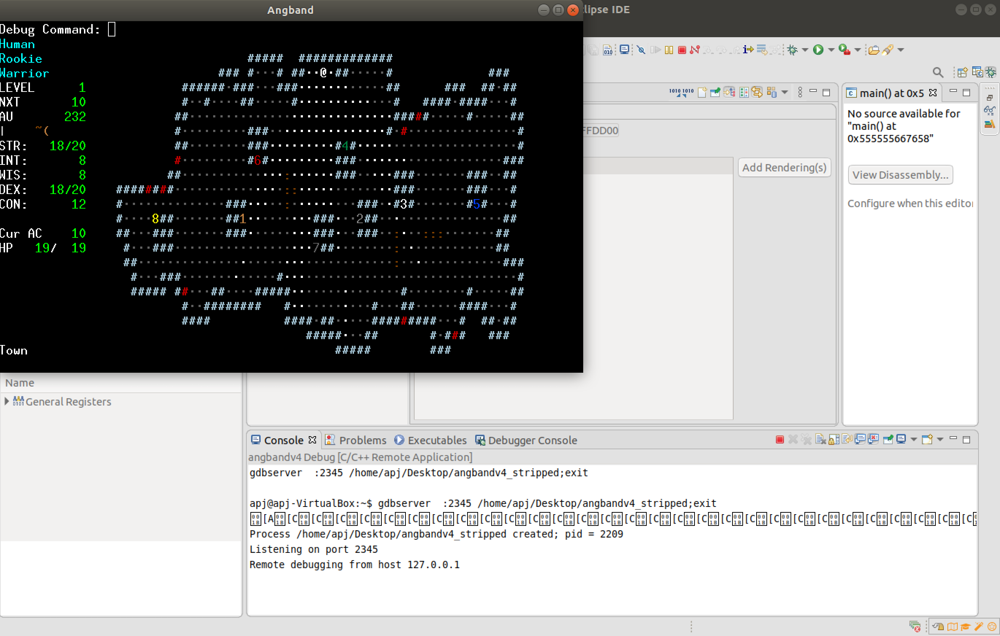

6. The vulnerable accepts 9 (8 + 1) value as input and stores in the variable "param_1" and then uses "param_1" in the _printf_  function. This can be seen while inspecting the functions in Ghidra. 

    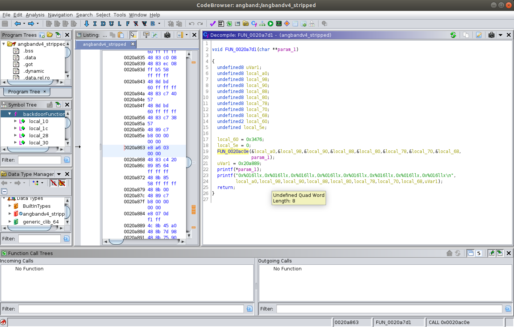

7. Now break point is added for the _printf_ function after checking the dissasembly window.  

    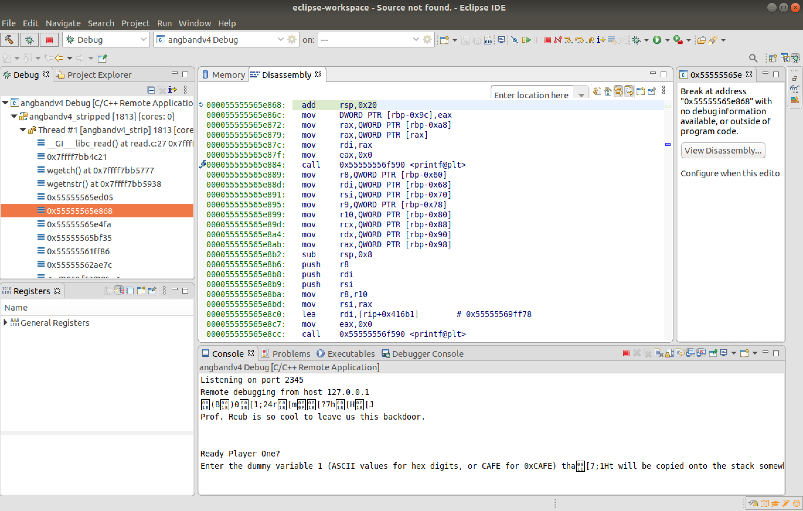

8. Now the 8 values required for dummy variables [1-8] are provided as "0x000[1-8]" and the format specifier was provided as "0x%016llx". 

    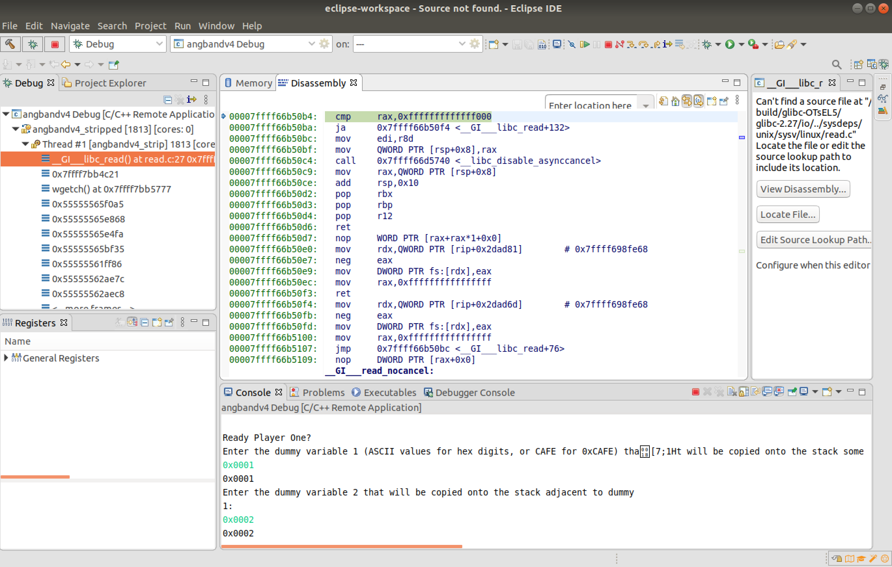

    The memory of the _$rbp_ register is observed to view the reflected changes. The memory address that the change reflects start from "0x00007FFFFFFFDD84"; this is noted. 

    

9. With this knowledge, a tainted buffer value is constructed to conduct an attack to dumb leak data from the stack frame. The C program "makeExploitString.c" will produce a format string specifier that will essentially read out of bounds from the memory stack.

    The "makeExploitString.c" program is constructed such that it will output a format string specifier that is the hexa decimal value of the string 16 "%016llx". This will essentially perform an out of bounds read and leak 8 more bytes of data from memory in the stack frame close to the newly initialized dummy variables. 

    

    It is observed that providing this value as the input for the format string specifier, we will be able to leak memory from the stack frame.

    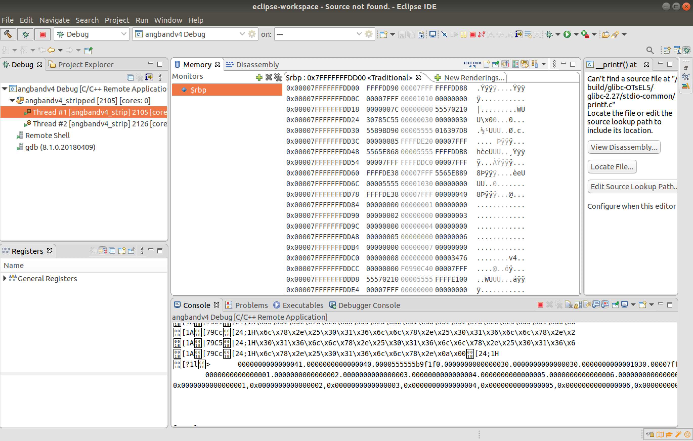

    The output will contain an extra output of 16 bytes from stack frame.

10. Now to conduct an arbitrary read, the #if directive is reversed. This program now will read the from the address provided in the first dummy variable. 

    It was found that the USER value is placed at the address "00007FFFFFFFEB5F" in the stack memory.

    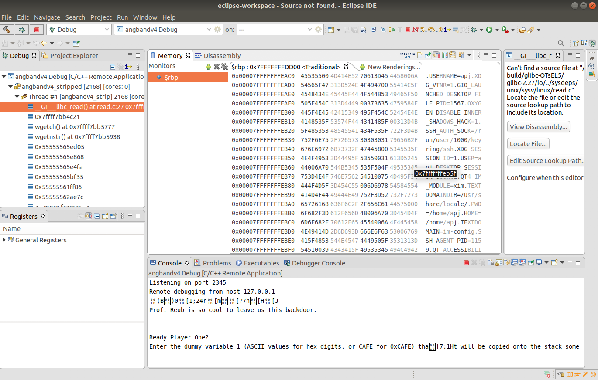

    This is provided as the input for the first dummy variable, so that format specifier that is provided at the end will read from the arbitrary memory provided. The output of the program is in hexadecimal format.

    

    By providing these appropriate inputs, it is observed that there is a smart leak and the USER information has been leaked in the output. 

    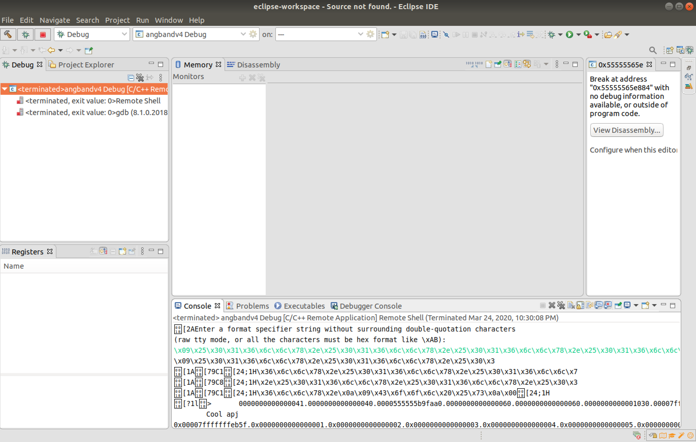

    Hence the exploit of Format String Vulnerability was successful and dumb and smart leaks were conducted.
